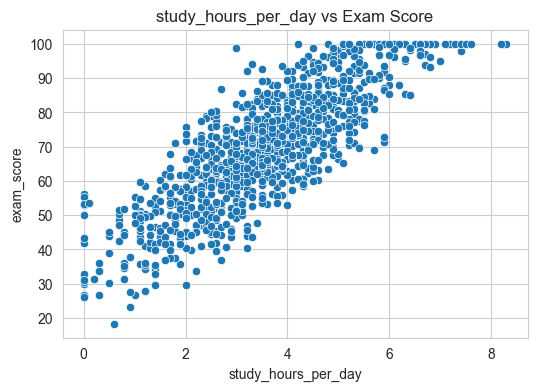
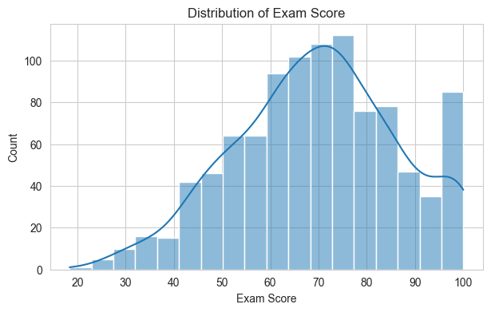
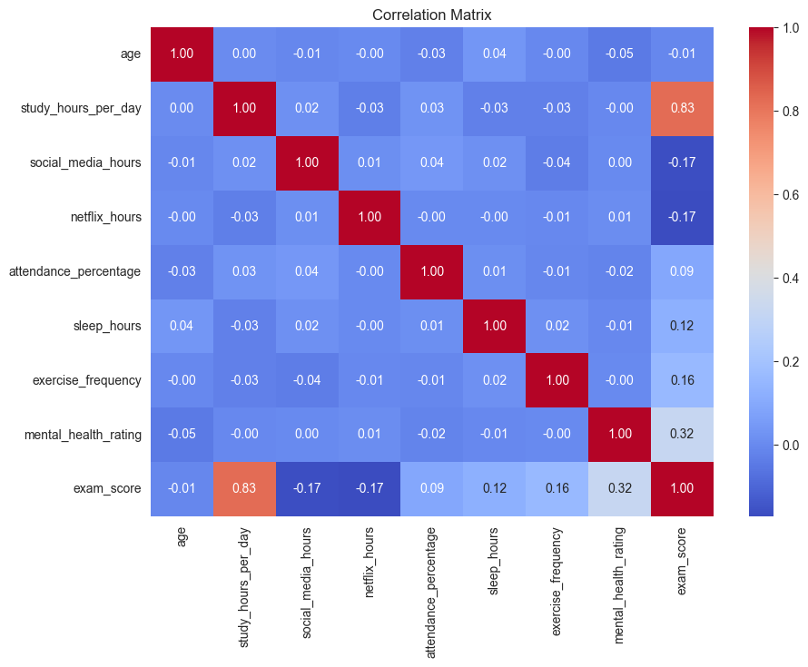
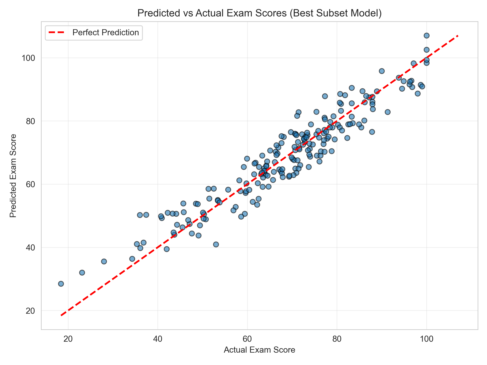
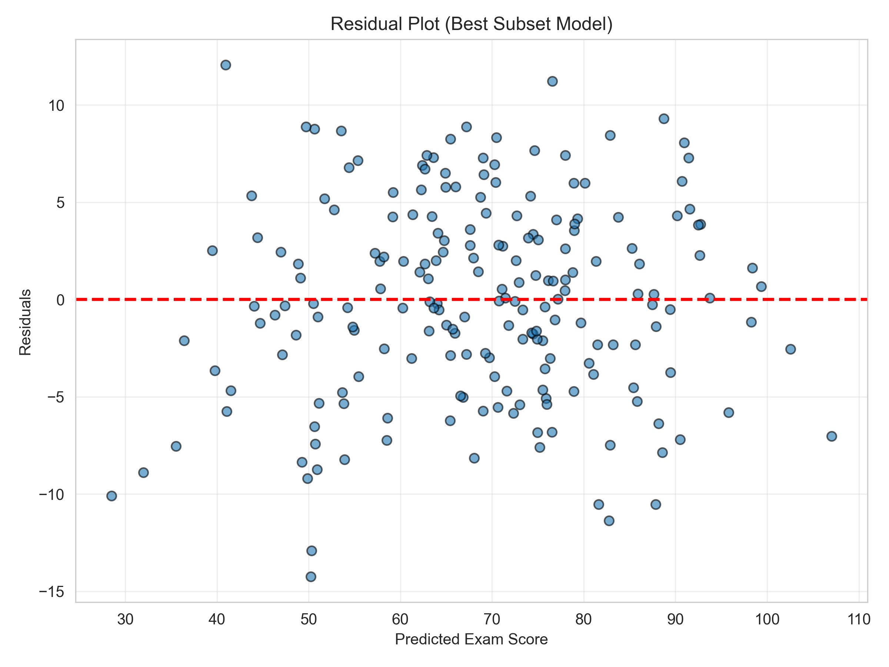
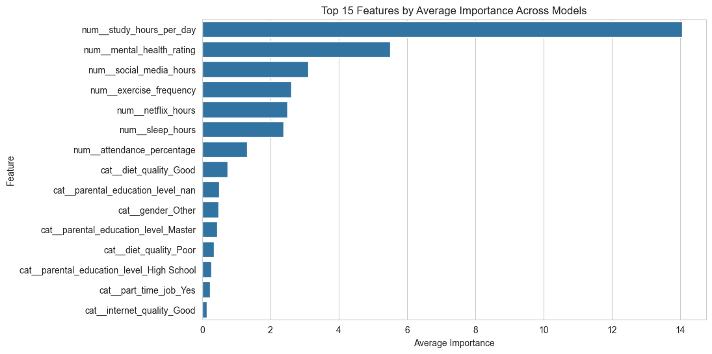

# 🎓 Student Habits vs Academic Performance

<p align="center">
  
</p>

<p align="center">
  <b>Predicting students' exam scores using behavioral, lifestyle, demographic, and academic features.</b>
</p>

<p align="center">
  
  
  
  
  
</p>

---

## 📌 Project Overview

This project analyzes the **Student Habits vs Academic Performance** dataset to predict students' final **exam scores** based on different academic, lifestyle, behavioral, and demographic factors.

The main target variable is:
```text
exam_score

The project applies a complete machine learning workflow including:

- Exploratory Data Analysis
- Statistical Hypothesis Testing
- Data Preprocessing
- Leakage Prevention
- Linear Regression
- Ridge Regression
- Lasso Regression
- Cross-Validation
- Feature Selection
- Model Comparison
- Final Model Interpretation

The final selected model is **Best Subset Selection**, which achieved the best balance between predictive performance and interpretability.

---

## 🎯 Project Objectives

The main objectives of this project are:

- Explore the dataset and understand the distribution of variables.
- Analyze relationships between student habits and exam performance.
- Test meaningful statistical hypotheses.
- Build regression models to predict exam scores.
- Compare baseline regression models with regularized models.
- Apply feature selection methods.
- Select a final model based on accuracy, error metrics, cross-validation, and simplicity.
- Interpret the most important predictors of academic performance.

---

## 📊 Dataset Description

The dataset contains student-level information related to academic habits, lifestyle, and personal characteristics.

### Target Variable

| Variable | Description |
|---|---|
| `exam_score` | Student's final exam score |

### Main Predictors

| Feature | Type | Description |
|---|---|---|
| `student_id` | Identifier | Unique student identifier |
| `age` | Numerical | Student age |
| `gender` | Categorical | Student gender |
| `study_hours_per_day` | Numerical | Average daily study hours |
| `social_media_hours` | Numerical | Daily social media usage |
| `netflix_hours` | Numerical | Daily Netflix usage |
| `part_time_job` | Categorical | Whether the student has a part-time job |
| `attendance_percentage` | Numerical | Student attendance percentage |
| `sleep_hours` | Numerical | Average daily sleep hours |
| `diet_quality` | Categorical | Quality of diet |
| `exercise_frequency` | Numerical | Exercise frequency |
| `parental_education_level` | Categorical | Parents' education level |
| `internet_quality` | Categorical | Internet quality category |
| `mental_health_rating` | Numerical | Mental health rating |
| `extracurricular_participation` | Categorical | Extracurricular participation |

> Note: `student_id` was removed before modeling because it is only an identifier and does not provide meaningful predictive information.

---

## 🗂️ Project Structure

bash
.
├── figures/
│   ├── exam_score_distribution.png
│   ├── correlation_heatmap.png
│   ├── study_hours_vs_exam_score.png
│   ├── exam_score_by_gender.png
│   ├── exam_score_by_internet_quality.png
│   ├── average_Importance.png
│   ├── predicted_vs_actual_best_subset.png
│   ├── residual_plot_best_subset.png
│   └── best_subset_coefficients.png
│
├── HM_1.ipynb
├── ML_Project_1.md
├── ML_Project_1.pdf
├── report.pdf
└── README.md

---

## 🧪 Methodology

The project follows a structured machine learning pipeline:

text
Dataset Loading
↓
Exploratory Data Analysis
↓
Missing Value Analysis
↓
Hypothesis Testing
↓
Train/Test Split
↓
Preprocessing Pipeline
↓
Regression Modeling
↓
Regularization
↓
Feature Selection
↓
Model Evaluation
↓
Final Model Interpretation

---

## 🔍 Exploratory Data Analysis

EDA was conducted to understand the data distribution, identify missing values, inspect relationships between variables, and detect potential patterns.

The EDA section includes:

- Distribution of `exam_score`
- Missing value analysis
- Correlation heatmap
- Scatter plot of study hours vs exam score
- Boxplot of exam score by gender
- Boxplot of exam score by internet quality

### Exam Score Distribution

<p align="center">
  
</p>

### Correlation Heatmap

<p align="center">
  
</p>

### Study Hours vs Exam Score

<p align="center">
  
</p>

The scatter plot shows a clear positive relationship between `study_hours_per_day` and `exam_score`.

---

## 🧹 Missing Values

The dataset had missing values in the `parental_education_level` column.

| Variable | Missing Count | Missing Percentage |
|---|---:|---:|
| `parental_education_level` | 91 | 9.10% |
| Other variables | 0 | 0.00% |

Since `parental_education_level` is categorical, missing values were handled during preprocessing using an appropriate imputation strategy.

---

## 🧠 Hypothesis Testing

Several statistical tests were performed to evaluate relationships between student habits and exam performance.

The significance level was set to:

text
alpha = 0.05

If the p-value is less than 0.05, the null hypothesis is rejected.

### Hypothesis Testing Results

| Hypothesis | Test | Statistic | p-value | Decision |
|---|---|---:|---:|---|
| Study hours per day vs exam score | Pearson correlation | 0.8254 | 0.0000 | Reject H0 |
| Part-time job vs exam score | Independent t-test | -0.8523 | 0.3946 | Fail to reject H0 |
| High attendance vs low attendance | Independent t-test | 2.6865 | 0.0073 | Reject H0 |
| Internet quality vs exam score | Kruskal-Wallis | 3.2213 | 0.1998 | Fail to reject H0 |
| Gender vs exam score | One-way ANOVA | 0.1423 | 0.8674 | Fail to reject H0 |

### Key Hypothesis Testing Findings

- `study_hours_per_day` has a strong and statistically significant positive relationship with `exam_score`.
- Students with high and low attendance have significantly different exam scores.
- Having a part-time job does not show a statistically significant difference in exam scores.
- Internet quality does not show a statistically significant difference in exam score distributions.
- Gender does not show a statistically significant difference in mean exam scores.

---

## ⚙️ Data Preprocessing

The preprocessing stage was designed carefully to avoid data leakage.

Steps included:

- Removing `student_id`
- Splitting the data into training and testing sets
- Handling missing values
- Encoding categorical variables
- Scaling numerical variables
- Applying transformations only after fitting on the training data
- Using cross-validation correctly within the training process

### Data Leakage Prevention

To prevent data leakage:

- The dataset was split into training and testing sets before fitting transformations.
- Scalers and imputers were fitted only on the training data.
- The fitted transformations were then applied to the test data.
- During cross-validation, preprocessing was performed separately inside each fold.

This ensures that information from the test set does not influence model training.

---

## 🤖 Models Implemented

The following regression models were implemented:

### Baseline Models

- Linear Regression
- Ridge Regression
- Lasso Regression

### Feature Selection Models

- Forward Selection
- Backward Elimination
- Hybrid Selection
- Best Subset Selection

---

## 📏 Evaluation Metrics

Models were evaluated using:

| Metric | Description |
|---|---|
| R² | Proportion of variance explained by the model |
| Adjusted R² | R² adjusted for number of predictors |
| MAE | Mean Absolute Error |
| RMSE | Root Mean Squared Error |
| CV Mean R² | Mean cross-validation R² score |
| CV Std | Standard deviation of CV scores |
| Number of Features | Number of predictors used by the model |

---

## 🏆 Model Comparison Results

| Model | Category | R² | Adjusted R² | MAE | RMSE | CV Mean R² | CV Std | Features |
|---|---|---:|---:|---:|---:|---:|---:|---:|
| Best Subset Selection | Feature Selection | 0.899580 | 0.895919 | 4.113914 | 5.074502 | 0.897482 | — | 7 |
| Forward Selection | Feature Selection | 0.899151 | 0.894374 | 4.127266 | 5.085336 | 0.897552 | — | 9 |
| Hybrid Selection | Feature Selection | 0.899151 | 0.894374 | 4.127266 | 5.085336 | 0.897552 | — | 9 |
| Backward Elimination | Feature Selection | 0.899151 | 0.894374 | 4.127266 | 5.085336 | 0.897552 | — | 9 |
| Lasso Regression | Baseline Model | 0.898188 | 0.890483 | 4.150618 | 5.109554 | 0.897048 | 0.010417 | 14 |
| Linear Regression | Baseline Model | 0.896750 | 0.888937 | 4.189311 | 5.145506 | 0.895542 | 0.010553 | 14 |
| Ridge Regression | Baseline Model | 0.896389 | 0.888548 | 4.192304 | 5.154503 | 0.895754 | 0.010111 | 14 |

---

## ✅ Final Model

The final selected model is:

text
Best Subset Selection

### Why Best Subset Selection?

Best Subset Selection was chosen because it achieved:

- Highest test R² score
- Lowest MAE
- Lowest RMSE
- Strong cross-validation performance
- Fewer selected features
- Better interpretability compared to full baseline models

### Final Model Performance

| Metric | Value |
|---|---:|
| R² | 0.899580 |
| Adjusted R² | 0.895919 |
| MAE | 4.113914 |
| RMSE | 5.074502 |
| CV Mean R² | 0.897482 |
| Number of Features | 7 |

The final model explains approximately **89.96%** of the variance in exam scores while using only **7 selected predictors**.

---

## 📈 Final Model Visualizations

### Predicted vs Actual Values

<p align="center">
  
</p>

This plot compares the predicted exam scores with the actual exam scores. Points closer to the diagonal line indicate better predictions.

---

### Residual Plot

<p align="center">
  
</p>

The residual plot helps evaluate whether prediction errors are randomly distributed. A random pattern around zero suggests that the regression assumptions are reasonably satisfied.

---

### Best Subset Coefficients

<p align="center">
  
</p>

This plot shows the coefficients of the selected predictors in the final Best Subset Selection model. Larger absolute coefficient values indicate stronger influence on the predicted exam score.

---

## ⭐ Feature Importance

<p align="center">
  
</p>

The feature importance analysis supports the model interpretation by showing which predictors contribute most to exam score prediction.

Important predictors include study-related and attendance-related variables, which are consistent with the hypothesis testing results.

---

## 📌 Key Findings

The main findings of the project are:

- Study hours per day is strongly associated with exam performance.
- Attendance is statistically significant in explaining exam score differences.
- Part-time job status does not show a significant effect on exam scores.
- Internet quality does not show a significant relationship with exam score distribution.
- Gender does not show a significant difference in mean exam scores.
- Best Subset Selection achieved the best overall performance.
- A smaller number of carefully selected features can perform as well as or better than using all predictors.

---

## 🛠️ Technologies Used

The project was implemented using:

<p align="left">
  
  
  
  
  
  
  
  
</p>

### Main Libraries

python
pandas
numpy
matplotlib
seaborn
scikit-learn
scipy
statsmodels

---

## 🚀 How to Run

### 1. Clone the Repository

bash
git clone https://github.com/your-username/student-habits-performance.git
cd student-habits-performance

### 2. Install Required Packages

bash
pip install pandas numpy matplotlib seaborn scikit-learn scipy statsmodels jupyter

### 3. Open the Notebook

bash
jupyter notebook HM_1.ipynb

### 4. Run All Cells

Run the notebook cells in order to reproduce:

- EDA outputs
- hypothesis testing results
- preprocessing pipeline
- regression models
- feature selection results
- final visualizations

---

## 📄 Report

The full report contains:

- Abstract
- Introduction
- Dataset description
- Exploratory Data Analysis
- Missing value analysis
- Hypothesis testing
- Preprocessing and leakage prevention
- Linear, Ridge, and Lasso Regression
- Feature selection methods
- Model comparison
- Final model evaluation
- Discussion
- Conclusion

---

## 🧾 Course Requirement Alignment

This project satisfies the main machine learning project requirements:

| Requirement | Status |
|---|---|
| Exploratory Data Analysis | Completed |
| Missing value analysis | Completed |
| Hypothesis testing | Completed |
| Data preprocessing | Completed |
| Leakage prevention | Completed |
| Linear Regression | Completed |
| Ridge Regression | Completed |
| Lasso Regression | Completed |
| Cross-validation | Completed |
| Feature selection | Completed |
| Model comparison | Completed |
| Final interpretation | Co and visualizations | Completed |

---

## 🔮 Future Improvements

Possible future extensions include:

- Adding polynomial features
- Testing interaction terms
- Trying nonlinear models
- Applying Random Forest or Gradient Boost